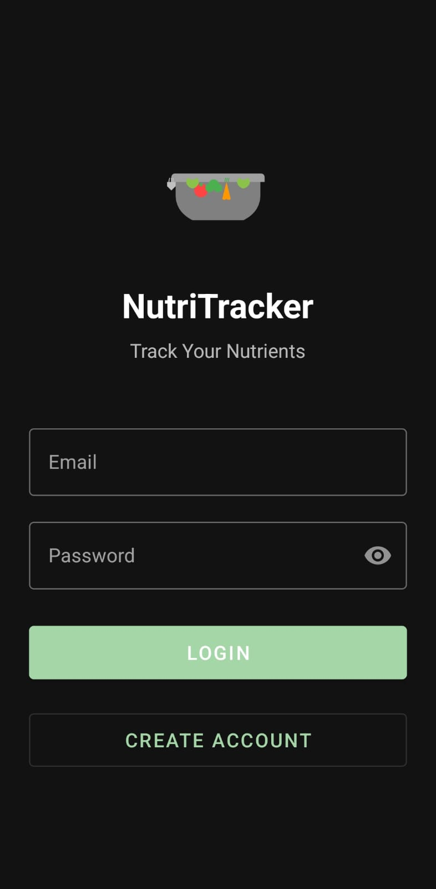
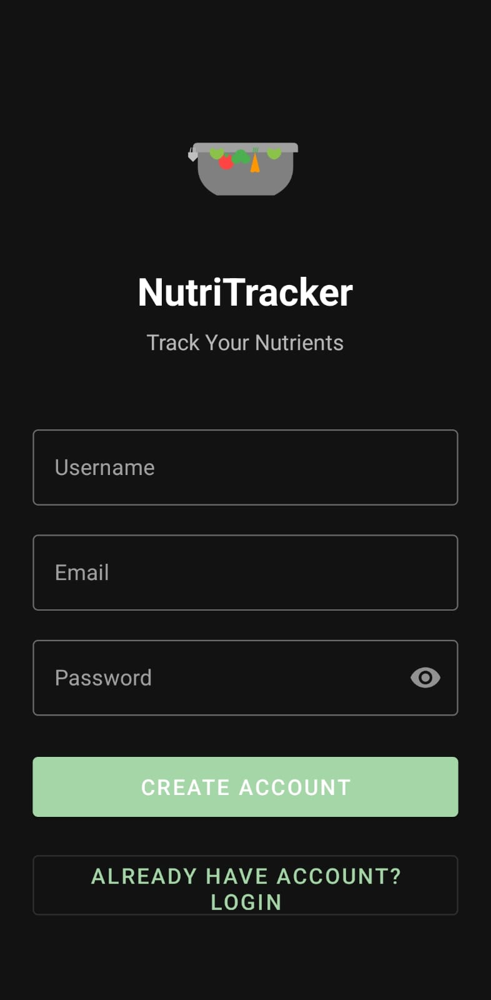
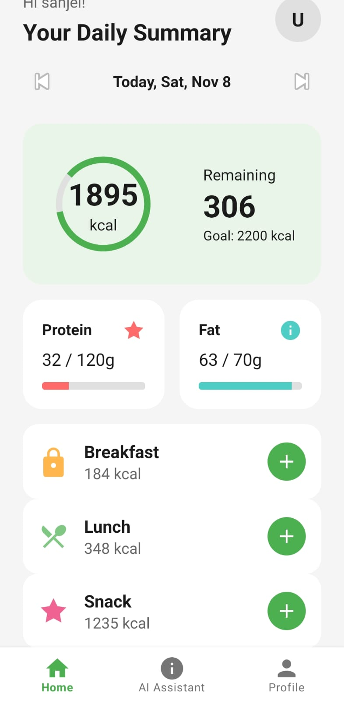
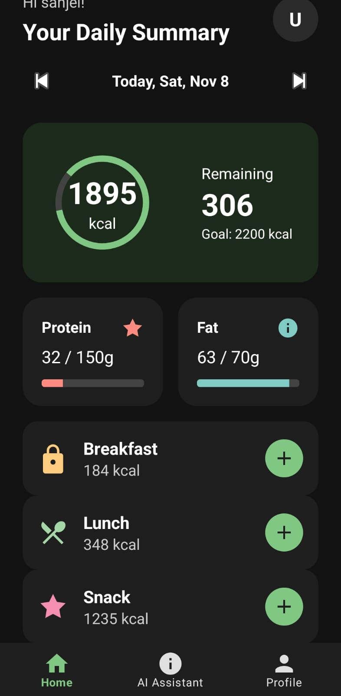
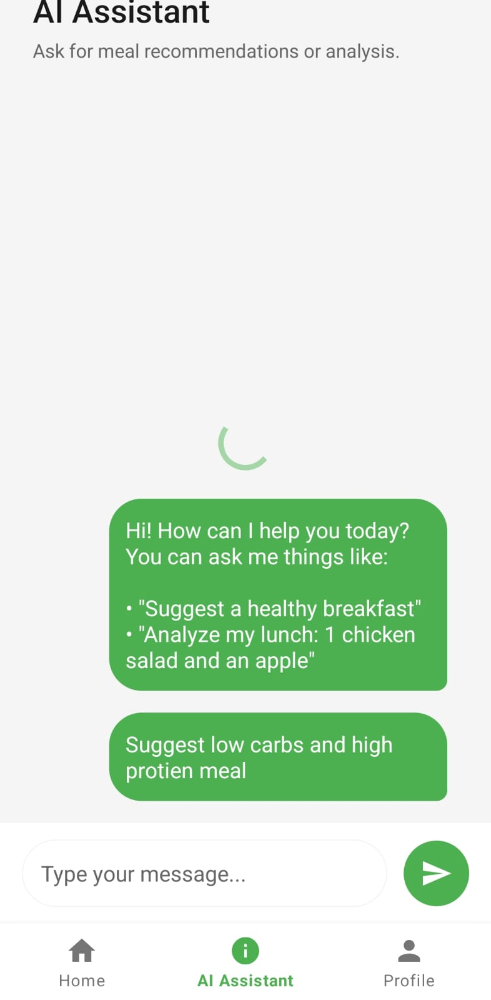
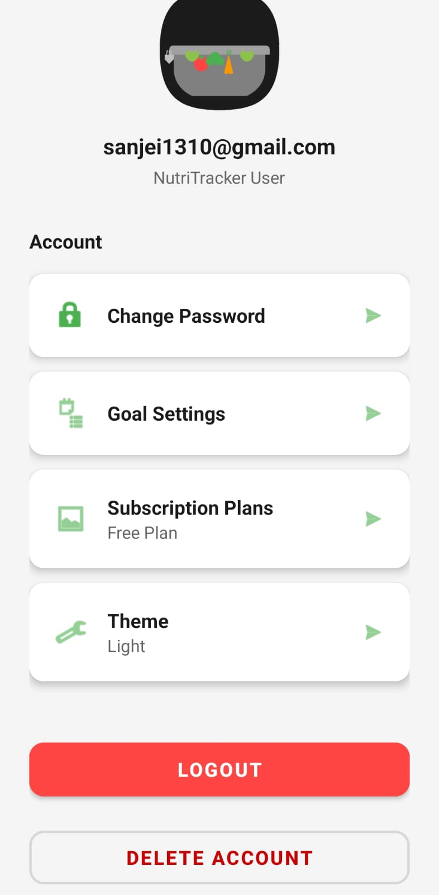

# NutriTracker 🥗

A modern Android nutrition tracking application that helps users monitor their daily food intake, track calories and macronutrients, and get AI-powered nutrition assistance.

> **🚀 New to this project?** Check out the [Quick Start Guide](QUICK_START.md) to get running in 15 minutes!

## Features

- **User Authentication**: Secure email/password authentication using Firebase Auth
- **Nutrition Tracking**: Track calories, protein, carbs, and fat intake
- **Food Search**: Search for foods using the USDA FoodData Central API
- **Meal Categories**: Organize meals by Breakfast, Lunch, Snack, and Dinner
- **AI Assistant**: Get nutrition advice and recommendations
- **Activity Logging**: Track user interactions and app usage
- **Cloud Sync**: All data stored securely in Firebase Firestore
- **Dark Mode Support**: Automatic theme switching based on system preferences

## Screenshots

<p align="center">
  
  
  
</p>

<p align="center">
  
  
  
</p>

## Tech Stack

- **Language**: Java
- **Min SDK**: 24 (Android 7.0)
- **Target SDK**: 36
- **Architecture**: MVVM with LiveData
- **Backend**: Firebase (Auth + Firestore)
- **API**: USDA FoodData Central API
- **UI**: Material Design Components

## Dependencies

- AndroidX AppCompat & Material Design
- Firebase Authentication
- Firebase Firestore
- Firebase Analytics
- OkHttp for networking
- Gson for JSON parsing
- RecyclerView & CardView
- Lifecycle Components (ViewModel & LiveData)

## Prerequisites

Before running this project, you need:

1. **Android Studio** (Arctic Fox or later)
2. **JDK 11** or higher
3. **Firebase Account** (free tier works) - **REQUIRED**
4. **USDA API Key** (free) - **REQUIRED** for food search
5. **Google Gemini API Key** (free) - **REQUIRED** for AI assistant

## Firebase Setup

1. Go to [Firebase Console](https://console.firebase.google.com/)
2. Create a new project or use an existing one
3. Add an Android app with package name: `com.example.nutritracker`
4. Download the `google-services.json` file
5. Place it in the `app/` directory (replace the existing one)
6. Enable **Email/Password** authentication:
   - Go to Authentication → Sign-in method
   - Enable Email/Password provider
7. Create a **Firestore Database**:
   - Go to Firestore Database
   - Create database in production mode
   - Choose a location closest to your users

### Firestore Security Rules

```javascript
rules_version = '2';
service cloud.firestore {
  match /databases/{database}/documents {
    // User activities - users can only read/write their own data
    match /user_activities/{document} {
      allow read, write: if request.auth != null && request.auth.uid == resource.data.userId;
      allow create: if request.auth != null && request.auth.uid == request.resource.data.userId;
    }
    
    // User profiles - users can only access their own profile
    match /users/{userId} {
      allow read, write: if request.auth != null && request.auth.uid == userId;
    }
    
    // Nutrition entries - users can only access their own entries
    match /nutrition_entries/{userId}/entries/{entry} {
      allow read, write: if request.auth != null && request.auth.uid == userId;
    }
  }
}
```

## Installation & Setup

1. **Clone the repository**
   ```bash
   git clone https://github.com/yourusername/nutritracker.git
   cd nutritracker
   ```

2. **Open in Android Studio**
   - Open Android Studio
   - Select "Open an existing project"
   - Navigate to the cloned directory

3. **Configure API Keys**
   - Follow the Firebase Setup steps above
   - Ensure `google-services.json` is in the `app/` directory with your actual Firebase credentials
   - Add your USDA API key in `AddFoodActivity.java`
   - Add your Gemini API key in `AiAssistantActivity.java`
   - See "API Configuration" section for detailed instructions

4. **Sync Gradle**
   - Android Studio should automatically sync
   - If not, click "Sync Project with Gradle Files"

5. **Run the app**
   - Connect an Android device or start an emulator
   - Click the "Run" button or press Shift+F10

## Building the APK

### Debug Build
```bash
./gradlew assembleDebug
```
The APK will be in `app/build/outputs/apk/debug/`

### Release Build
```bash
./gradlew assembleRelease
```
The APK will be in `app/build/outputs/apk/release/`

Note: For release builds, you'll need to configure signing in `app/build.gradle.kts`

## Project Structure

```
app/src/main/
├── java/com/example/nutritracker/
│   ├── LoginActivity.java           # Authentication screen
│   ├── HomeActivity.java            # Main dashboard
│   ├── AddFoodActivity.java         # Add food entries
│   ├── AiAssistantActivity.java     # AI chat interface
│   ├── ProfileActivity.java         # User profile
│   ├── UserActivityViewActivity.java # Activity logs
│   ├── firebase/
│   │   ├── FirebaseService.java     # Firebase operations
│   │   ├── NutritionEntry.java      # Nutrition data model
│   │   ├── UserActivityModel.java   # Activity data model
│   │   └── UserProfile.java         # User profile model
│   └── utils/
│       └── ThemeManager.java        # Theme management
├── res/
│   ├── layout/                      # XML layouts
│   ├── drawable/                    # Images and icons
│   ├── values/                      # Strings, colors, themes
│   └── menu/                        # Menu resources
└── AndroidManifest.xml
```

## Usage

1. **Register/Login**: Create an account or sign in with existing credentials
2. **Add Food**: Search for foods and add them to your daily log
3. **Track Progress**: View your daily nutrition totals on the home screen
4. **AI Assistant**: Get personalized nutrition advice
5. **View Activities**: Check your app usage history from the menu
6. **Profile**: Manage your account settings

## API Configuration

### Required API Keys

This app requires three API keys to function properly:

#### 1. Firebase Configuration (Required)
1. Go to [Firebase Console](https://console.firebase.google.com/)
2. Create a new project or use an existing one
3. Add an Android app with package name: `com.example.nutritracker`
4. Download the `google-services.json` file
5. Replace the placeholder file in `app/google-services.json` with your downloaded file
   - A template is provided at `app/google-services.json.example` for reference
6. Enable **Email/Password** authentication in Firebase Console
7. Create a **Firestore Database** in production mode

**Note:** The `google-services.json` file in this repository contains placeholder values. You MUST replace it with your actual Firebase configuration file.

#### 2. USDA FoodData Central API (Required for Food Search)
1. Get a free API key from [USDA FoodData Central](https://fdc.nal.usda.gov/api-key-signup.html)
2. Open `app/src/main/java/com/example/nutritracker/AddFoodActivity.java`
3. Replace `PASTE_YOUR_USDA_API_KEY_HERE` with your actual API key:
   ```java
   private static final String API_KEY = "YOUR_ACTUAL_USDA_API_KEY";
   ```

#### 3. Google Gemini AI API (Required for AI Assistant)
1. Get a free API key from [Google AI Studio](https://aistudio.google.com/app/apikey)
2. Open `app/src/main/java/com/example/nutritracker/AiAssistantActivity.java`
3. Replace `PASTE_YOUR_GEMINI_API_KEY_HERE` with your actual API key:
   ```java
   private static final String GEMINI_API_KEY = "YOUR_ACTUAL_GEMINI_API_KEY";
   ```

**⚠️ IMPORTANT SECURITY NOTE:**
- Never commit your actual API keys to version control
- Keep your `google-services.json` file private
- Consider using environment variables or secure key management for production apps
- If you accidentally commit API keys, rotate them immediately
- For detailed setup instructions, see [API_SETUP_GUIDE.md](API_SETUP_GUIDE.md)

## Contributing

Contributions are welcome! Please feel free to submit a Pull Request.

1. Fork the project
2. Create your feature branch (`git checkout -b feature/AmazingFeature`)
3. Commit your changes (`git commit -m 'Add some AmazingFeature'`)
4. Push to the branch (`git push origin feature/AmazingFeature`)
5. Open a Pull Request

## License

This project is licensed under the MIT License - see the LICENSE file for details.

## Acknowledgments

- USDA FoodData Central for nutrition data
- Firebase for backend services
- Material Design for UI components

